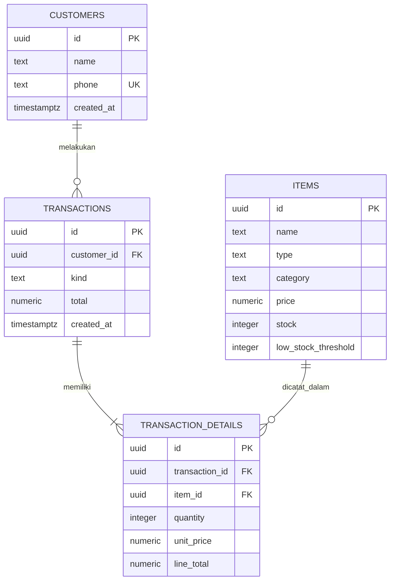

# Petshop dan Grooming Dzakiya

Aplikasi persediaan dan pencatatan transaksi sederhana dengan frontend HTML/CSS/JavaScript, backend Node.js tanpa paket eksternal, dan Supabase Postgres.

## Struktur

- `frontend/` - antarmuka aplikasi.
- `backend/app.js` - server HTTP dan API yang memakai Supabase REST.
- `backend/schema.sql` - empat tabel, fungsi transaksi atomik, indeks, keamanan RLS, dan katalog awal.
- `docs/skema-database.md` - dokumentasi lengkap ERD, entitas, relasi, constraint, alur transaksi, dan akses database.

## ERD (4 entitas)

Produk dan layanan berada pada entitas `items`; kolom `type` membedakan keduanya. Transaksi penjualan otomatis mengurangi stok melalui fungsi Postgres yang berjalan atomik.

## Menjalankan Tanpa Node.js

1. Jalankan `backend/schema.sql` di Supabase SQL Editor.
2. URL dan publishable key sudah diatur di `frontend/app.js`.
3. Buka `frontend/index.html` langsung di browser. Frontend menghubungi Supabase REST API tanpa server lokal.

`backend/app.js` adalah opsi server Node terpisah dan tidak diperlukan untuk cara menjalankan statis ini. Tidak ada `package.json` maupun dependensi runtime.

**Peringatan:** skema saat ini menonaktifkan RLS dan memberi role `anon` akses baca/tulis ke data pelanggan, stok, transaksi, dan RPC. Siapa pun yang mendapat URL project dapat mengakses database. Aktifkan autentikasi dan kebijakan RLS sebelum memakai data produksi.
